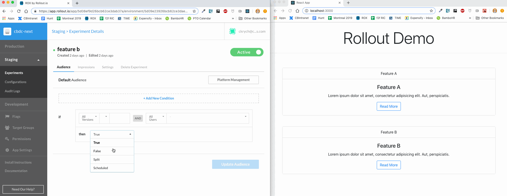

# rollout-react
This is a demo app to work with [rollout.io](https://app.rollout.io/).
This project was bootstrapped with [Create React App](https://github.com/facebook/create-react-app).

## Pre-requisites

* have an account and an app configure in SaaS rollout.io
* have an environment (let's call this env `staging`) and its `APP_KEY`, `DEV_SECRET`
* in the `staging` env, configure 2 flags named `demo.featureA` and`demo.featureB` with boolean values.
* copy your rollout keys:
```
cp .env .env.local
```
and add your rollout keys.

## Build and run
### Build
```
yarn install
```
### Run the demo

**Steps for the demo:**
* run the app locally
```
yarn start
```
* open a browser to the Rollout admin UI
* change the value of `demo.featureA`

**The question is:** 

How/when do you want to rollout the server side changes to the user without being disruptive. 
The user might be in a middle of a session afterall..


With rollout, the UI will get notified (via SSE) that a change happened to the value of your flag. 

**The options:**


 - either don't inform the user and let her discover the changes on the next load of the SPA app )full reload of the page).
 - or get notified a change occurs (via callback method `configurationFetchedHandler`, pop up an alert message or toast 
 to leave the option to the end user. The alert can have a option to see changes now (`Rox.unfreeze`). This is what the demo is show casing.)
 - push in real time the changes to the user \o/ with the optiosn `freeze: 'none`



